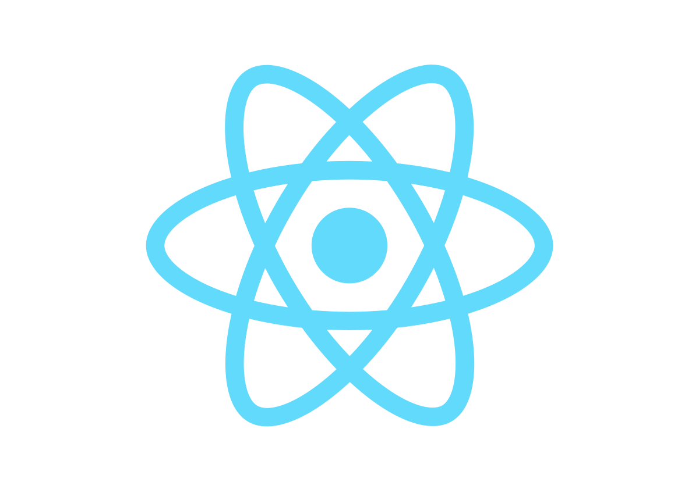
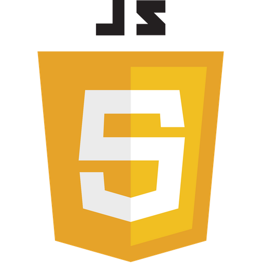
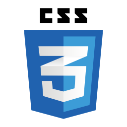
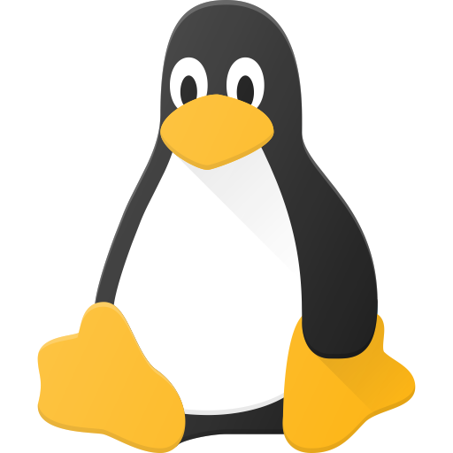

# William Costa

Apaixonado por desenvolvimento e inovação ❤️

_______

## Canal no YouTube

   

  

  Canal de tecnologia com conteúdos sobre programação e super dicas para a galera que está começando no mundo dev.

  Toda **quinta** às **20h** tem vídeo novo, então inscreva-se para não perder nenhuma novidade:

  

_______

#### Linguagens e ferramentas que uso atualmente:

  

  

  

  

  

  

  

  

  

  

  

  

_______

